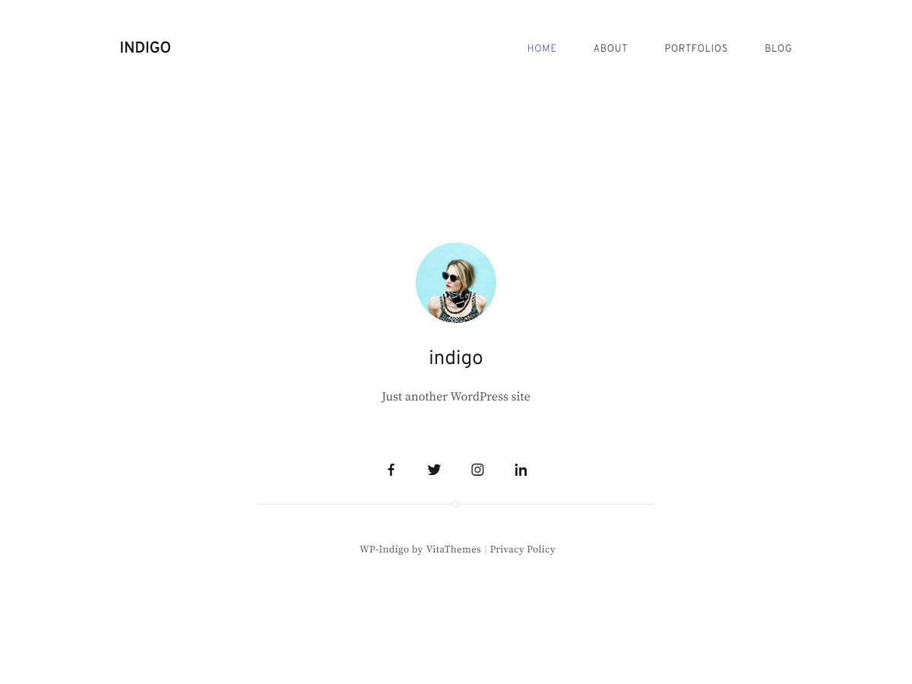

# WP-Indigo - [Demo](https://demo.vitathemes.com/indigo/) | [Download](https://wordpress.org/themes/wp-indigo/)

Indigo is a modern WordPress theme with a simple yet elegant design. This minimal theme is suitable for almost any type of website and perfect for personal blogs and portfolios. While it is minimal and lightweight, it is responsive, flexible, customizable with WordPress customizer, and has a clean optimized code.



## Features

- No additional JS
- Sass for stylesheets
- Compatible with [Contact Form 7](https://wordpress.org/plugins/contact-form-7/)
- Fast & lightweight (Google Speed: 99/100)
- Theme options built directly into WordPress native live theme customizer
- Responsive design
- Cross-browser compatibility
- Custom Google WebFonts
- Child themes support
- Developer friendly extendable code
- Translation ready (with .POT files included)
- Right-to-left (RTL) languages support
- SEO optimized
- GNU GPL version 3.0 licensed
- …and much more

See a working example at [demo.vitathemes.com/indigo](https://demo.vitathemes.com/indigo/).

## Theme installation

1. Simply install as a normal WordPress theme and activate.
2. Make a page called Home and set the Page template to Home.
3. Make another page called Blog and set the Page template to Blog.
4. In your admin panel, navigate to `Settings > Reading`.
5. Select `A static page (select below)` and select the pages created.
6. In your admin panel, navigate to `Appearance > Customize`.
7. Put the finishing touches on your website by adding a logo, typography settings, custom colors and etc.
8. Active recommended plugin at the top.
9. After libWp plugin activated go to `Settings > Permalink` and select `Post name` (\*this option is recommended) radio button and save the changes.
10. A section called Portfolios will appear at bottom of posts. you can add your portfolios there.

## Theme structure

```shell
themes/wp-indigo/                 # → Root of your theme
├── assets/                       # → Assets files
│   ├── css/                      # → Compiled CSS file
│   ├── fonts/                    # → Theme images
│   ├── images/                   # → Theme images
│   ├── js/                       # → Theme images
│   └── src/                      # → Theme scss files
├── classes/                      # → Theme Language files
├── languages/                    # → Theme Language files
├── node_modules/                 # → Theme Language files
├── page-templates/               # → Theme Part files (Include)
├── template-parts/               # → Theme Part files (Include)
├── package.json                  # → Node.js dependencies and scripts
├── inc/                          # → Theme functions
│   ├── tgmpa/                    # → Custom PHP classes
│   ├── customizer.php/           # → Kirki Customization framework
│   ├── setup.php                 # → All codes related to WordPress Customizer (We use Kirki Framework)
│   ├── template-functions.php    # → Custom template tags & tweaks
└── └── template-tags.php         # → Theme Setup
```

## Theme setup

Edit `inc/setup.php` to enable or disable theme features, setup navigation menus, post thumbnail sizes, and sidebars.

## Theme development

- Run `npm install` from the theme directory to install dependencies
- Update `gulpfile.js` settings:
  - `proxy` should reflect your local development hostname
- Run `gulp` for build the distribution

## Contributing

Contributions are welcome from everyone. We have [contributing guidelines](CONTRIBUTING.md) to help you get started.

## License

WP-Indigo is licensed under [GNU GPL](LICENSE).

## ❤️ Sponsors
<a href="" target="_blank"></a>

Want to become a sponsor? you can sponsor & support VitaThemes by providing our team your service for free!
